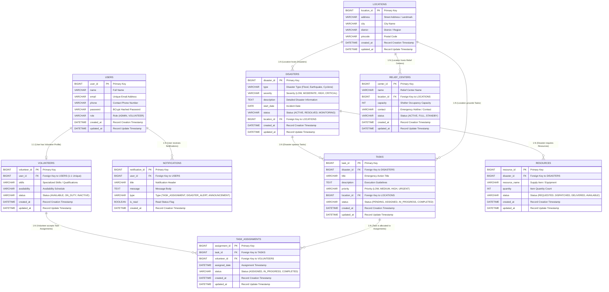

# Entity-Relationship (ER) Diagram
## Volunteer Disaster Relief Coordination System

This document provides the full Database Design & Entity-Relationship (ER) Diagram specification for the **Volunteer Disaster Relief Coordination System**.

---

## 1. Mermaid ER Diagram

---

## 2. Relationships & Cardinalities Summary

| Parent Entity | Cardinality | Child Entity | Foreign Key | Description |
| :--- | :---: | :--- | :--- | :--- |
| **USERS** | **1 : 1** | **VOLUNTEERS** | `VOLUNTEERS.user_id` | Each volunteer user links to exactly one volunteer profile. |
| **USERS** | **1 : M** | **NOTIFICATIONS** | `NOTIFICATIONS.user_id` | A user can receive multiple alerts and notifications. |
| **VOLUNTEERS** | **1 : M** | **TASK_ASSIGNMENTS** | `TASK_ASSIGNMENTS.volunteer_id` | A volunteer can be assigned to multiple relief tasks. |
| **TASKS** | **1 : M** | **TASK_ASSIGNMENTS** | `TASK_ASSIGNMENTS.task_id` | A single relief task can have task assignment logs. |
| **DISASTERS** | **1 : M** | **TASKS** | `TASKS.disaster_id` | An active disaster spawns emergency response tasks. |
| **DISASTERS** | **1 : M** | **RESOURCES** | `RESOURCES.disaster_id` | A disaster requires specific relief supplies and items. |
| **LOCATIONS** | **1 : M** | **DISASTERS** | `DISASTERS.location_id` | Geographic location hosting disaster incidents. |
| **LOCATIONS** | **1 : M** | **RELIEF_CENTERS** | `RELIEF_CENTERS.location_id` | Physical location hosting relief shelter centers. |
| **LOCATIONS** | **1 : M** | **TASKS** | `TASKS.location_id` | Location target where task execution takes place. |
