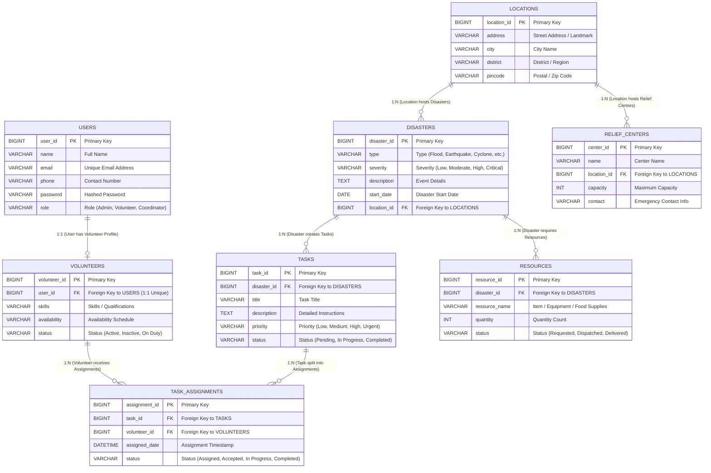

# Entity-Relationship (ER) Diagram
## Volunteer Disaster Relief Coordination System

This document provides the complete Database Design & Entity-Relationship (ER) Diagram specification for the **Volunteer Disaster Relief Coordination System**.

---

## 1. ER Diagram



---

## 2. Relationships & Cardinalities

| Parent Entity | Relationship | Child Entity | Foreign Key | Description |
| :--- | :---: | :--- | :--- | :--- |
| **USERS** | **1 : 1** | **VOLUNTEERS** | `VOLUNTEERS.user_id` | User with volunteer role has one volunteer profile. |
| **VOLUNTEERS** | **1 : M** | **TASK_ASSIGNMENTS** | `TASK_ASSIGNMENTS.volunteer_id` | Volunteer assigned to multiple task assignments. |
| **TASKS** | **1 : M** | **TASK_ASSIGNMENTS** | `TASK_ASSIGNMENTS.task_id` | Task allocated to one or multiple volunteers. |
| **DISASTERS** | **1 : M** | **TASKS** | `TASKS.disaster_id` | Disaster requires multiple emergency tasks. |
| **DISASTERS** | **1 : M** | **RESOURCES** | `RESOURCES.disaster_id` | Disaster requires multiple emergency resources. |
| **LOCATIONS** | **1 : M** | **DISASTERS** | `DISASTERS.location_id` | Location hosts disaster events. |
| **LOCATIONS** | **1 : M** | **RELIEF_CENTERS** | `RELIEF_CENTERS.location_id` | Location contains relief center shelters. |

---

## 3. Database Table Definitions (Data Dictionary)

### 3.1 `USERS`
- `user_id` (PK, BIGINT, AUTO_INCREMENT)
- `name` (VARCHAR(100), NOT NULL)
- `email` (VARCHAR(150), UNIQUE, NOT NULL)
- `phone` (VARCHAR(20))
- `password` (VARCHAR(255), NOT NULL)
- `role` (VARCHAR(50), NOT NULL)

### 3.2 `VOLUNTEERS`
- `volunteer_id` (PK, BIGINT, AUTO_INCREMENT)
- `user_id` (FK -> `USERS.user_id`, BIGINT, UNIQUE, NOT NULL)
- `skills` (VARCHAR(255))
- `availability` (VARCHAR(100))
- `status` (VARCHAR(50), NOT NULL)

### 3.3 `DISASTERS`
- `disaster_id` (PK, BIGINT, AUTO_INCREMENT)
- `type` (VARCHAR(100), NOT NULL)
- `severity` (VARCHAR(50), NOT NULL)
- `description` (TEXT)
- `start_date` (DATE, NOT NULL)
- `location_id` (FK -> `LOCATIONS.location_id`, BIGINT, NOT NULL)

### 3.4 `LOCATIONS`
- `location_id` (PK, BIGINT, AUTO_INCREMENT)
- `address` (VARCHAR(255))
- `city` (VARCHAR(100), NOT NULL)
- `district` (VARCHAR(100), NOT NULL)
- `pincode` (VARCHAR(20), NOT NULL)

### 3.5 `TASKS`
- `task_id` (PK, BIGINT, AUTO_INCREMENT)
- `disaster_id` (FK -> `DISASTERS.disaster_id`, BIGINT, NOT NULL)
- `title` (VARCHAR(150), NOT NULL)
- `description` (TEXT)
- `priority` (VARCHAR(50), NOT NULL)
- `status` (VARCHAR(50), NOT NULL)

### 3.6 `TASK_ASSIGNMENTS`
- `assignment_id` (PK, BIGINT, AUTO_INCREMENT)
- `task_id` (FK -> `TASKS.task_id`, BIGINT, NOT NULL)
- `volunteer_id` (FK -> `VOLUNTEERS.volunteer_id`, BIGINT, NOT NULL)
- `assigned_date` (DATETIME, NOT NULL)
- `status` (VARCHAR(50), NOT NULL)

### 3.7 `RESOURCES`
- `resource_id` (PK, BIGINT, AUTO_INCREMENT)
- `disaster_id` (FK -> `DISASTERS.disaster_id`, BIGINT, NOT NULL)
- `resource_name` (VARCHAR(150), NOT NULL)
- `quantity` (INT, NOT NULL)
- `status` (VARCHAR(50), NOT NULL)

### 3.8 `RELIEF_CENTERS`
- `center_id` (PK, BIGINT, AUTO_INCREMENT)
- `name` (VARCHAR(150), NOT NULL)
- `location_id` (FK -> `LOCATIONS.location_id`, BIGINT, NOT NULL)
- `capacity` (INT, NOT NULL)
- `contact` (VARCHAR(100))

---

## 4. MySQL Create Table DDL Script

```sql
CREATE DATABASE IF NOT EXISTS disaster_relief_db;
USE disaster_relief_db;

CREATE TABLE locations (
    location_id BIGINT AUTO_INCREMENT PRIMARY KEY,
    address VARCHAR(255),
    city VARCHAR(100) NOT NULL,
    district VARCHAR(100) NOT NULL,
    pincode VARCHAR(20) NOT NULL
) ENGINE=InnoDB DEFAULT CHARSET=utf8mb4;

CREATE TABLE users (
    user_id BIGINT AUTO_INCREMENT PRIMARY KEY,
    name VARCHAR(100) NOT NULL,
    email VARCHAR(150) NOT NULL UNIQUE,
    phone VARCHAR(20),
    password VARCHAR(255) NOT NULL,
    role VARCHAR(50) NOT NULL DEFAULT 'VOLUNTEER'
) ENGINE=InnoDB DEFAULT CHARSET=utf8mb4;

CREATE TABLE volunteers (
    volunteer_id BIGINT AUTO_INCREMENT PRIMARY KEY,
    user_id BIGINT NOT NULL UNIQUE,
    skills VARCHAR(255),
    availability VARCHAR(100),
    status VARCHAR(50) NOT NULL DEFAULT 'AVAILABLE',
    CONSTRAINT fk_volunteers_users FOREIGN KEY (user_id) 
        REFERENCES users(user_id) ON DELETE CASCADE ON UPDATE CASCADE
) ENGINE=InnoDB DEFAULT CHARSET=utf8mb4;

CREATE TABLE disasters (
    disaster_id BIGINT AUTO_INCREMENT PRIMARY KEY,
    type VARCHAR(100) NOT NULL,
    severity VARCHAR(50) NOT NULL,
    description TEXT,
    start_date DATE NOT NULL,
    location_id BIGINT NOT NULL,
    CONSTRAINT fk_disasters_locations FOREIGN KEY (location_id) 
        REFERENCES locations(location_id) ON DELETE RESTRICT ON UPDATE CASCADE
) ENGINE=InnoDB DEFAULT CHARSET=utf8mb4;

CREATE TABLE relief_centers (
    center_id BIGINT AUTO_INCREMENT PRIMARY KEY,
    name VARCHAR(150) NOT NULL,
    location_id BIGINT NOT NULL,
    capacity INT NOT NULL DEFAULT 0,
    contact VARCHAR(100),
    CONSTRAINT fk_relief_centers_locations FOREIGN KEY (location_id) 
        REFERENCES locations(location_id) ON DELETE RESTRICT ON UPDATE CASCADE
) ENGINE=InnoDB DEFAULT CHARSET=utf8mb4;

CREATE TABLE tasks (
    task_id BIGINT AUTO_INCREMENT PRIMARY KEY,
    disaster_id BIGINT NOT NULL,
    title VARCHAR(150) NOT NULL,
    description TEXT,
    priority VARCHAR(50) NOT NULL DEFAULT 'MEDIUM',
    status VARCHAR(50) NOT NULL DEFAULT 'PENDING',
    CONSTRAINT fk_tasks_disasters FOREIGN KEY (disaster_id) 
        REFERENCES disasters(disaster_id) ON DELETE CASCADE ON UPDATE CASCADE
) ENGINE=InnoDB DEFAULT CHARSET=utf8mb4;

CREATE TABLE task_assignments (
    assignment_id BIGINT AUTO_INCREMENT PRIMARY KEY,
    task_id BIGINT NOT NULL,
    volunteer_id BIGINT NOT NULL,
    assigned_date DATETIME NOT NULL DEFAULT CURRENT_TIMESTAMP,
    status VARCHAR(50) NOT NULL DEFAULT 'ASSIGNED',
    CONSTRAINT fk_assignments_tasks FOREIGN KEY (task_id) 
        REFERENCES tasks(task_id) ON DELETE CASCADE ON UPDATE CASCADE,
    CONSTRAINT fk_assignments_volunteers FOREIGN KEY (volunteer_id) 
        REFERENCES volunteers(volunteer_id) ON DELETE CASCADE ON UPDATE CASCADE
) ENGINE=InnoDB DEFAULT CHARSET=utf8mb4;

CREATE TABLE resources (
    resource_id BIGINT AUTO_INCREMENT PRIMARY KEY,
    disaster_id BIGINT NOT NULL,
    resource_name VARCHAR(150) NOT NULL,
    quantity INT NOT NULL DEFAULT 0,
    status VARCHAR(50) NOT NULL DEFAULT 'REQUESTED',
    CONSTRAINT fk_resources_disasters FOREIGN KEY (disaster_id) 
        REFERENCES disasters(disaster_id) ON DELETE CASCADE ON UPDATE CASCADE
) ENGINE=InnoDB DEFAULT CHARSET=utf8mb4;
```
